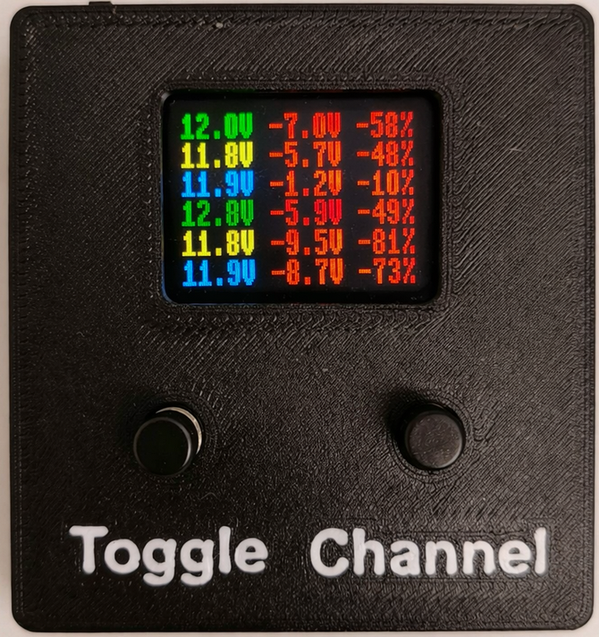
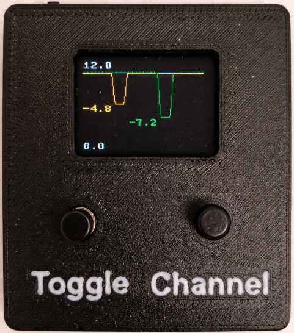

# Pico Voltage Dip Monitor

High-frequency voltage dip monitoring for Raspberry Pi Pico 2, with an onboard OLED UI and optional live streaming to InfluxDB and Grafana.

  
  

## Why This Project

- Samples three channels at 100 Hz on a Pico 2.
- Detects short voltage sags using baseline-aware dip detection.
- With the configured voltage-divider scaling, measures and calibrates external inputs from the Pico's 3.3V ADC domain up to about 60V.
- Runs standalone on-device or streams live data over USB.
- Shows live stats and dip graphs on an SSD1351 OLED.
- Includes PC tools for download, validation, plotting, and live monitoring.

## Quick Start

1. Install MicroPython on a Raspberry Pi Pico 2 and upload the files in [`src/`](src/).
2. Wire your inputs to `GP26`, `GP27`, and `GP28` with a common ground.
3. Pick a logging mode in [`src/config.py`](src/config.py).
4. Run [`src/main.py`](src/main.py).

Recommended modes:

| Mode | Best for |
| --- | --- |
| `EVENT_ONLY` | Standalone logging with minimal flash wear |
| `USB_STREAM` | Live monitoring with InfluxDB and Grafana |
| `FULL_LOCAL` | Short debug runs with full local median history |
| `DISPLAY_ONLY` | OLED-focused demos and UI performance testing |

> [!WARNING]
> Never exceed `3.3V` on Pico ADC pins. This project scales that ADC range to roughly `60V` external input with the configured voltage dividers.

## How It Works

- The Pico samples `PLC`, `MODEM`, and `BATTERY` every `10 ms`.
- It computes `100 ms` medians, updates per-channel baselines, and detects dips from raw samples.
- Depending on mode, it logs events locally, keeps a rolling history, or streams data to a PC.

## Further Reading

- [`docs/THONNY_SETUP.md`](docs/THONNY_SETUP.md) easiest path to get the Pico running
- [`docs/QUICKSTART.md`](docs/QUICKSTART.md) shorter setup walkthrough
- [`docs/wiring.md`](docs/wiring.md) wiring and safety notes
- [`docs/SETUP_INFLUXDB.md`](docs/SETUP_INFLUXDB.md) live dashboard setup
- [`docs/PLOTTING.md`](docs/PLOTTING.md) offline CSV analysis
- [`docs/data-formats.md`](docs/data-formats.md) CSV schemas
- [`docs/troubleshooting.md`](docs/troubleshooting.md) common hardware and Thonny issues
- [`docs/architecture.md`](docs/architecture.md) runtime flow and design notes
- [`CHEATSHEET.md`](CHEATSHEET.md) quick commands and reminders

## License

[MIT](LICENSE)
